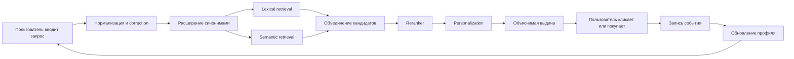

# BPMN Draft

Ниже зафиксирована логика BPMN для хакатонной презентации. Это не исполняемая схема, а готовая текстовая спецификация, по которой можно быстро собрать диаграмму в draw.io, Miro или Mermaid.

## Дорожки

Рекомендуемая схема:

1. Пользователь
2. Система
3. Результат и данные

Если организаторы требуют строго две дорожки, объединяй `Система` и `Результат и данные` в одну дорожку, а данные выноси как артефакты.

## Последовательность процесса

1. Пользователь вводит запрос.
2. Система принимает запрос и user_id.
3. Система нормализует текст запроса.
4. Система исправляет опечатки.
5. Система расширяет запрос синонимами.
6. Система извлекает кандидатов lexical search.
7. Система извлекает кандидатов semantic search.
8. Система объединяет кандидатов в hybrid retrieval.
9. Система применяет reranker к top-кандидатам.
10. Система применяет персонализацию по профилю пользователя.
11. Система формирует объяснимую выдачу.
12. Пользователь просматривает результаты.
13. Пользователь взаимодействует с карточкой: click, favorite, purchase.
14. Система записывает событие.
15. Система обновляет профиль пользователя.
16. Следующий запрос получает изменённую выдачу.

## BPMN-описание по дорожкам

### Дорожка Пользователь

1. Start event: Возникла потребность найти товар.
2. Task: Ввести поисковый запрос.
3. Task: Просмотреть результаты.
4. Exclusive gateway: Результат подходит?
5. Task: Кликнуть, добавить в избранное или купить.
6. End event: Найден нужный товар.

### Дорожка Система

1. Task: Принять запрос и параметры пользователя.
2. Task: Выполнить correction и synonym expansion.
3. Parallel gateway: lexical retrieval и semantic retrieval.
4. Task: Объединить кандидатов.
5. Task: Выполнить rerank.
6. Task: Выполнить personalization rerank.
7. Task: Вернуть результаты и reasons.
8. Task: Сохранить пользовательское событие.
9. Task: Обновить пользовательский профиль.

### Дорожка Результат и данные

1. Data object: Каталог СТЕ.
2. Data object: Словарь синонимов.
3. Data object: Индекс semantic retrieval.
4. Data object: История событий.
5. Data object: Профиль пользователя.
6. Data object: Метрики качества поиска.

## Mermaid Черновик

## Что показать на схеме устно

1. Поиск не линейный, а гибридный.
2. Персонализация не заменяет релевантность, а перестраивает релевантные кандидаты.
3. Система самообучается через события пользователя.
4. Следующий запрос уже использует обновлённый профиль.